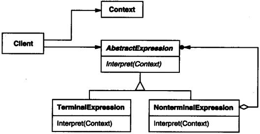

# Design Patterns (设计模式)

- [面向对象六大原则](#面向对象六大原则)
  - [单一职责原则](#单一职责原则)
  - [迪米特法则](#迪米特法则)
  - [开放-封闭原则](#开放-封闭原则)
  - [依赖倒转原则](#依赖倒转原则)
  - [里氏代换原则](#里氏代换原则)
  - [接口隔离原则](#接口隔离原则)
- [创建型模式](#创建型模式)
  - [Abstract Factory-抽象工厂](#Abstract-Factory-抽象工厂)
  - [Builder-建造者](#Builder-建造者)
  - [Factory Method-工厂方法](#Factory-Method-工厂方法)
  - [Prototype-原型](#Prototype-原型)
  - [Singleton-单例](#Singleton-单例)
- [结构型模式](#结构型模式)
  - [Adapter-适配器](#Adapter-适配器)
  - [Bridge-桥接](#Bridge-桥接)
  - [Composite-组合](#Composite-组合)
  - [Decorator-装饰](#Decorator-装饰)
  - [Facade-外观](#Facade-外观)
  - [Flyweight-享元](#Flyweight-享元)
  - [Proxy-代理](#Proxy-代理)
- [行为模式](#行为模式)
  - [Chain of Responsibility-责任链](#Chain-of-Responsibility-责任链)
  - [Command-命令](#Command-命令)
  - [Interpreter-解释器](#Interpreter-解释器)
  - [Iterator-迭代器](#Iterator-迭代器)
  - [Mediator-中介者](#Mediator-中介者)
  - [Memento-备忘录](#Memento-备忘录)
  - [Observer-观察者](#Observer-观察者)
  - [State-状态](#State-状态)
  - [Strategy-策略](#Strategy-策略)
  - [Template Method-模板方法](#Template-Method-模板方法)
  - [Visitor-访问者](#Visitor-访问者)

## 面向对象六大原则

### 单一职责原则

- 就一个类而言,应该仅有一个引起它变化的原因

### 迪米特法则

- 如果两个类不必彼此直接通信,那么这两个类就不应当发生直接的相互作用.如果其中的类需要调用另一个类的某一个方法的话,可以通过第三者转发这个调用

### 开放-封闭原则

- 对于扩展是开放的,对于更改是封闭的，就是说软件实体应该可以扩展,但不可修改

### 依赖倒转原则

- 高层模块不应该依赖低层模块.两个都应该依赖抽象

- 高层不应该依赖细节,细节应该依赖于抽象

### 里氏代换原则

- 子类必须能够替换掉他们的父类型

### 接口隔离原则

- 客户端不应该依赖它不需要的接口,一个类对另一个类的依赖应该建立在最小的接口上

## 创建型模式

- 创建型模式抽象了实例化过程.他们帮助一个系统独立于如何创建,组合和表示它的那些对象.一个类创建型模式使用继承改变被实例化的类,而一个对象创建型模式将实例化委托给另一个对象

### Abstract Factory-抽象工厂

#### 意图

* 提供一个创建一系列相关或相互依赖对象的接口,而无需指定他们具体的类.

#### 结构

#### 适用性

* 一个系统要独立于它的产品的创建、组合和表示时

* 一个系统要由多个产品系列中的一个来配置时

* 当你要强调一系列相关的产品对象的设计以便进行联合使用时

* 当你提供一个产品库,而只想显示他们的接口而不是实现时

#### 参与者

* AbstractFactory 声明一个创建抽象产品对象的操作接口

* ConcreateFactory 实现创建具体产品对象的操作

* AbstractProduct 为一类产品对象声明一个接口

* ConcreateProduct 定义一个将被相应的具体工厂创建的产品对象

* Client 仅使用AbstractFactory和AbstractProduct类声明的接口

#### 效果

* 它分离了具体的类

* 它使得易于交换产品系列

* 它利于产品的一致性

* 难以支持新种类的产品

#### 实现

* 将工厂作为单例

* 创建产品

* 定义可扩展的工厂

#### 相关

* AbstractFactory类常用工厂方法实现,但他们也可用Protorype实现

* 一个具体的工厂通常是一个单例

### Builder-建造者

#### 意图

* 将一个复杂对象的构建与它的表示分离,使得同样的构建过程可以创建不同的表示

#### 结构

#### 适用性

* 当创建复杂对象的算法应该独立于该对象的组成部分以及它们的装配方式时

* 当构造过程必须被允许被构造的对象有不同表示时

#### 参与者

* Builder 为创建一个个Product对象的各个部件指定抽象接口

* ConcreateBuilder

  * 实现Builder的接口以构造和装配该产品的各个部件

  * 定义并明确它所创建的表示

  * 提供一个检索产品的接口

* Director 构造一个使用builder接口的对象

* Product

  * 表示被构造的复杂对象.ConcreateBuilder创建该产品的内部表示并定义它的装配过程

  * 包含定义组成部件的类,包括将这些部件装配成最终产品的接口

#### 效果

* 他使你可以改变一个产品的内部表示

* 它将构造代码和表示代码分开

* 它使你可对构造过程进行更加精细的控制

#### 实现

* 通常有一个抽象的Builder类为导向者可能要求创建的每一个构件定义一个操作.这些操作缺省情况下什么都不做.一个ConcreateBuilder类对它有兴趣创建的构件重定义这些操作.

* 装配和构造接口

* 产品没有抽象类

* Builder缺省方法为空

#### 相关

* AbstractFactory与Builder相似,因为它也可以创建复杂对象.主要区别是Builder模式着重于一步步构造一个复杂对象,而AbstractFactory着重于多个系列的产品对象.Builder在最后一步返回产品,而对于AbstractFactory来说,产品是立即返回的.

* Composite通常是用Builder生成的

### Factory Method-工厂方法

#### 意图

* 定义一个用于创建对象的接口,让子类决定创建哪一个类实例化.Factory Method使一个类的实例化延迟到其子类

#### 结构

#### 适用性

* 当一个类不知道它所必须创建的对象的类的时候

* 当一个类希望由它的子类创建对象的时候

* 当类将创建对象的职责委托给多个帮助子类中的某一个,并且你希望哪一个帮助子类是代理者这一信息局部化的时候

#### 参与者

* Product 定义工厂方法所创建的对象的接口

* ConcreateProduct 实现Product接口

* Creator

  * 声明工厂方法,该方法返回一个Product类型的对象.Create也可以定义一个工厂方法的缺省实现,它返回一个缺省的ConcreateProduct对象

  * 可以调用工厂方法以返回一个ConcreateProduct实例

* ConcreateCreator 重定义工厂方法以返回一个ConcreateProduct实例

#### 效果

* 工厂方法不再将与特定应用有关的类绑定到你的代码中,代码仅处理Product接口,因此它可以与用户定义的任何ConcreateProduct类一起使用

* 工厂方法的一个潜在缺点在于客户可能仅仅为了创建一个特定的ConcreateProduct对象,就不得不创建Creator的子类.当Creator子类不必须时,客户现在必然要处理类演化的其他方面,但是当客户无论如何必须创建Creator子类时,也是可行的

* 为子类提供挂钩

* 连接平行的类层次

#### 实现

* 两种情况

  * Creator类是抽象类并且不提供它所声明的工厂方法的实现

  * Creator是一个具体的类并且为工厂方法提供一个缺省的实现

* 参数化工厂方法

* 特定语言的变化和问题

* 使用模板类以避免创建子类

* 命名约定

#### 相关

* AbstractFactory经常用FactoryMethod实现

* FactoryMethod通常在TemplateMethod中被调用

* Prototype不需要创建Creator的子类.但是,他们通常要求一个针对Product类的Initalize操作.Creator使用Initialize来初始化对象.而FactoryMethod不需要这样的操作

### Prototype-原型

#### 意图

* 用原型实例指定创建对象的种类,并且通过拷贝这个原型来创建新的对象

#### 结构

#### 适用性

* 当要实例化的类是在运行时刻指定时,例如,通过动态装载

* 为了避免创建一个与产品类层次平行的工厂类层次时

* 当一个类的实例只能有几个不同状态组合中的一种时.建立相应数目的原型并克隆它们可能比每次用合适的状态手工实例化该类更方便一些

#### 参与者

* Prototype 声明一个克隆自身的接口

* ConcreatePrototype 实现一个克隆自身的操作

* Client 让一个原型克隆自身从而创建一个新的对象

#### 效果

* 它对客户隐藏了具体的产品类,因此减少了客户知道的名字的数目.此外,这些模式使客户无需改变即可使用与特定应用相关的类

* 运行时刻增加和删除产品

* 改变值以指定新对象

* 改变结构以指定新对象

* 减少子类的构造

* 用类动态配置应用

#### 实现

* 使用一个原型管理器

* 实现克隆操作

* 初始化克隆对象

#### 相关

* Prototype和AbstractFactory在某种方面是相互竞争的.但他们也可以一起使用.AbstractFactory可以存储一个被克隆的原型的集合,并返回产品对象

* 大量使用Composite和Decorator的设计通常也可从Prototype处获益

### Singleton-单例

#### 意图

* 保证一个类仅有一个实例,并提供一个访问它的全局访问点.

* 结构

#### 适用性

* 当类只能有一个实例而且客户可以从一个众所周知的访问点访问它时

* 当这个唯一实例应该是通过子类化可扩展的,并且客户应该无需更改代码就能使用一个扩展的实例时

#### 参与者

* Singleton

  * 定义一个Instance操作,允许客户访问它的唯一实例.Instance是一个类操作

  * 可能负责创建它自己的唯一实例

#### 效果

* 对唯一实例的受控访问

* 缩小名空间

* 允许对操作和表示的精化

* 允许可变数目的实例

* 比类操作更灵活

#### 实现

* 保证一个唯一的实例

* 创建Singleton类的子类

#### 相关

* 很多模式都可以使用Singleton模式实现

## 结构型模式

#### 结构性模式涉及到如何组合类和对象以获得更大的结构.结构型模式采用继承机制来组合接口或实现.这一模式尤其助于多个独立开发的类库协同工作

### Adapter-适配器

#### 意图

* 将一个类的接口转换成客户希望的另一个接口.Adapter模式使得原本由于接口不兼容而不能一起工作的那些类可以一起工作.结构性对象模式不是对接口和实现进行组合而是描述了如何对一些对象进行组合,从而实现新功能的一些方法

#### 结构

* 类适配器使用多重继承对一个接口与另一个接口进行匹配

* 对象匹配器依赖于对象组合

#### 参与者

* Target 定义Client使用的与特定领域相关的接口

* Client 与符合Target接口的对象协同

* Adaptee 定义一个已存在的接口,这个接口需要适配

* Adapter 对Adaptee接口与Target接口进行适配

#### 效果

1. 类适配器

* 用一个具体的Adapter类对Adaptee和Target进行匹配.结果是我们想要匹配一个类以及所有它的子类时,类Adapter将不能胜任工作

* 使得Adapter可以重定义Adaptee的部分行为,因为Adapter是Adaptee的一个子类

* 仅仅引入了一个对象,并不需要额外的指针以间接得到Adaptee

2. 对象适配器

* 允许一个Adapter与多个Adaptee,即Adaptee本身以及它所有的子类同时工作.Adapter也可以一次给所有的Adaptee添加功能

* 使得重定义Adaptee的行为比较困难.这就需要生成Adaptee的子类并且使得Adapter可能不一样

#### 实现

1. 需要注意

* Adapter的匹配程度

* 可插入的Adapter

  * 使用抽象操作

  * 使用代理对象

  * 参数化的Adapter

* 使用双向适配器提供透明操作

#### 相关

* Bridge的结构与对象适配器类似,但是Bridge的出发点不同,Bridge目的是将接口部分和实现部分分离,从而对它们可以较为容易也相对独立的加以改变.而Adapter则意味着改变一个已有对象的接口

* Decorator增强了其他对象的功能而同时又不改变它的接口.因此Decorator对应用程序的透明性比适配器要好.结果是Decorator支持递归组合,而纯粹使用适配器是不可能实现这一点的

* Proxy在不改变它的接口条件下,为另一个对象定义了代理

### Bridge-桥接

#### 意图

* 将抽象部分与它的实现部分分离,使它们都可以独立的变化

#### 结构

#### 适用性

* 你不希望在抽象和它的实现部分之间有一个固定的绑定关系.可能是因为在程序运行时刻实现部分可以被选择或者切换

* 类的抽象以及它的实现都应该可以通过生成子类的方法加以扩充.这是Bridge使你可以对不同的抽象接口和实现部分进行组合,并分别对它们进行扩充

* 对一个抽象的实现部分的修改应对客户不产生影响,即客户的代码不必重新编译

* 你有许多类要生成.这样一种层次结构说明你必须将一个对象分解成两个部分

* 你想在多个对象间共享实现,但同时要求客户并不知道这一点

#### 参与者

* Abstraction

  * 定义抽象类的接口

  * 维护一个指向Implementor类型对象的指针

* RefinedAbstraction 扩充由Abstraction定义的接口

* Implementor 定义实现类的接口,该接口不一定要与Abstraction接口完全一致,事实上这两个接口可以完全不同.一般来讲,Implementor接口仅提供基本操作,而Abstraction则定义了基于这些基本操作的较高层次的操作

* ConcreateImplementor 实现Implementor接口并定义它的具体实现

#### 效果

* 分离接口及其实现部分

* 提高可扩充性

* 实现细节对客户透明

#### 实现

* 仅有一个Implementor

* 创建正确的Implementor对象

* 共享Implementor对象

* 采用多继承机制

#### 相关

* AbstractFactory可以用来创建和配置一个特定的Bridge

* Adapter用来帮助无关的类协同工作,它通常在系统设计完成后才被使用.然而,Bridge则是在系统开始时就被使用,它使得抽象接口和实现部分可以独立进行改变

### Composite-组合

#### 意图

* 将对象组合成树状结构以表示"部分-整体"的层次结构.Composite使得客户对单个对象的使用具有一致性.

#### 结构

#### 适用性

* 你想表示对象的部分-整体层次结构

* 你希望用户忽略组合对象与单个对象的不同,用户将统一地使用组合结构中的所有对象

#### 参与者

* Component

  * 为组合中的对象声明接口

  * 在适当情况下,实现所有类共有接口的缺省行为

  * 声明一个接口用于访问和管理Component的自组件

  * (可选)在递归结构中定义一个接口,用于访问一个父部件,并在合适的情况下实现它

* Leaf * 在组合中表示叶节点对象,叶节点没有子节点

  ** Composite

  * 定义有子部件的那些部件的行为

  * 在Component接口中实现与子部件有关的操作

* Client 通过Component接口中实现与子部件有关的操作

#### 效果

* 定义了包含基本对象和组合对象的类层次结构

* 简化客户代码

* 使得更容易增加新类型的组件

* 使你的设计更加一般化

#### 实现

* 显式的父部件引用

* 共享组件

* 最大化Component接口

* 声明管理子部件的操作

* 是否实现Component列表

* 子部件排序

* 使用高速缓冲存贮改善性能

* 应该由谁删除Component

* 存贮组件最好用哪一种数据结构

#### 相关

* 通常部件-父部件连接用于ResponsibilityofChain

* Decorator经常与Composite一起使用.它们通常有一个公共的父类.因此装饰必须支持具有Add,Remove和GetChild操作的Component接口

* Flyweight让你共享组件,但不再能引用它们的父部件

* Itertor可用来遍历Compoite

* Visitor将本来应该分布在Composite和Leaf类中的操作和行为局部化

### Decorator-装饰

#### 意图

* 动态地给一个对象添加一些额外的职责.就扩展功能而言,Decorator模式比生成子类更为灵活.

#### 结构

#### 适用性

* 在不影响其他对象的情况下,以动态透明的方式给单个对象添加职责

* 处理那些可以撤销的职责

* 当不能采用生成子类的方法进行扩充时

  * 可能有大量独立的扩展,为支持每种组合将产生大量的子类,使得子类数目呈爆炸性增长

  * 类定义被隐藏,或类定义不能被生成子类

#### 参与者

* Component 定义一个对象接口,可以给这些对象动态的添加职责

* ConcreateComponent 定义一个对象,可以给这个对象添加一些职责

* Decorator 维持一个指向Component对象的指针,并定义一个与Component接口一致的接口

* ConcreateDector 向组件添加职责

#### 效果

* 比继承更加灵活

* 避免在层次结构高层的类有太多的特征

* Decorator与它的Component不一样

* 有许多小对象

#### 实现

* 接口的一致性

* 省略抽象的Dectorator类

* 保持Component类的简单性

* 改变对象外壳与内核

#### 相关

* Decorator不同于Adapter,因为仅改变对象的职责而不改变它的接口,而Adapter将给对象一个全新的接口

* 可以将Decorator视为一个退化的,仅有一个组件的Composite.然而,装饰仅给对象添加一些额外的职责-它的目的不在于聚集

* 用一个Decorator你可以改变对象的外表,而Strategy使得你可以改变对象的内核,这是改变对象的两种途径

### Facade-外观

#### 意图

* 为子系统中的一组接口提供一个一致的界面,Facade模式定义了一个高层接口,这个接口使得这一子系统更加容易使用.

#### 结构

#### 适用性

* 当你要为一个复杂子系统提供一个简单接口时

* 客户程序与抽象类的实现部分之间存在着很大的依赖性

* 当你需要构建一个层次结构的子系统时,使用Facade定义子系统中每层的入口点

#### 参与者

* Facade

  * 知道哪些子系统类负责处理请求

  * 将客户的请求代理给合适的子系统对象

* SubsystemClasses

  * 实现子系统的功能

  * 处理由Facade对象指派的任务

  * 没有Facade的任何相关信息,即没有指向Facade的指针

#### 效果

* 它对客户屏蔽子系统组件,因而减少了客户处理对象的数目并使子系统使用更方便

* 它实现了子系统与客户间的松耦合关系,而子系统内部的功能组件往往是耦合的

* 如果应用需要,它并不限制它们使用子系统类,因此你可以在系统易用性和通用性之间选择

#### 实现

* 降低客户-子系统之间的耦合度

* 公共子系统类与私有子系统类

#### 相关

* AbstractFactory可以与Facade一起提供一个接口,这一接口可用来以一种子系统独立的方式创建子系统.AbstractFactory也可以代替Facade隐藏那些与平台无关的类

* Mediator与Facade相似之处是,它抽象了一些已有的类的功能.然而,Mediator的目的是对同事之间的任意通讯进行抽象,通常集中不属于任何单个对象的功能,Mediator的同事知道中介者并与它通信,而不是直接与其他对象通信,相对而言,Facade仅对于子系统对象的接口进行抽象,使它们更容易使用,它并不定义新功能,子系统也不知道Facade的存在

* 通常来说,仅需要一个Facade对象,因此Facade对象通常属于一个Singleton

### Flyweight-享元

#### 意图

* 运用共享技术有效的支持大量细粒度的对象.

#### 结构

#### 适用性

* 一个应用程序使用了大量的对象

* 完全由于使用了大量对象,造成很大的存储开销

* 对象的大多数状态都可变为外部状态

* 如果删除对象的外部状态,那么可以用相对较少的共享对象取代很多组对象

* 应用程序不依赖对象标识

#### 参与者

* Flyweight 描述一个接口,通过这个接口flyweight可以接受并作用于外部状态

* ConcreateFlyweight 实现Flyweight接口,并为内部状态(如果有的话)增加空间.ConcreateFlyweight对象必须是可共享的.它所存储的状态必须是内部的,即必须独立于ConcreateFlyweight对象的场景

* UnsharedConcreateFlyweight 并非所有的Flyweight子类都需要共享.Flyweight接口使共享成为可能,但它并不强制共享.在Flyweight对象结构的某些层次,UnsharedConcreateFlyweight对象通常将ConcreateFlyweight作为子节点

* FlyweightFactory

  * 创建并管理Flyweight对象

  * 确保合理的共享Flyweight.当用户请求一个Flyweight时,FlyweightFactory对象,提供一个已创建的实例或者创建一个

* Client

  * 维持一个对Flyweight的引用

  * 计算或存储一个(多个)Flyweight的外部状态

#### 效果

* 空间上的节省抵消了使用Flyweight时,传输,查找和计算外部状态产生的运行时的开销,共享的Flyweight越多,空间节省也越大

* 存储节约因素

  * 因为共享,实例总数减少的数目

  * 对象内部状态的平均数目

  * 外部状态是计算的还是存储的

#### 实现

* 注意

  * 1. 删除外部状态

  * 2. 管理共享对象

#### 相关

* Flyweight通常和Composite结合起来,用共享叶节点的有向无环图实现一个逻辑上的层次结构

* 通常,最好用Flyweight实现State和Strategy对象

### Proxy-代理

#### 意图

* 为其他对象提供一个代理以控制对这个对象的访问.

#### 结构

#### 适用性

* 远程代理 为一个对象在不同地址空间提供局部代表

* 虚代理 根据需要创建开销很大的对象

* 保护代理 控制对原始对象的访问

* 智能指引 取代了简单的指针,它在访问对象时执行一些附加操作

  * 对指向实际对象的引用计数,这样当该对象没有引用时,可以自动释放它

  * 当第一次引用一个持久化对象时,将它装入内存

  * 在访问一个实际对象前,检查是否已经锁定了它,以确保其他对象不能改变它

#### 参与者

* Proxy

  * 保存一个引用使得代理可以访问实体.若RealSubject和Subject的接口相同,Proxy会引用Subject

  * 提供一个与Subject的接口相同的接口,这样代理就可以用来代替实体

  * 控制对实体的存取,并可能负责创建和删除它

  * 其他功能依赖于代理的类型

* Subject 定义RealSubject和Proxy的公用接口,这样就在任何使用RealSubject的地方都可以使用Proxy

* RealSubject 定义Proxy所代表的实体

#### 效果

* 间接性的用途

  * RemoteProxy可以隐藏一个对象存在于不同地址空间的事实

  * VirtualProxy可以进行最优化,例如根据要求创建对象

  * ProtectionProxy和SmartReference都允许在访问一个对象时有一些附加操作

* Copy-on-write优化

#### 实现

* Proxy并不总是需要知道实体的类型

#### 相关

* Adapter为它所适配的对象提供了一个不同的接口,而代理提供了与它实体相同的接口.然而,用于访问保护的代理可能会拒绝实体会执行的操作,因此,它的接口实际上可能只是实体接口的一个个子集

* 尽管Decorator的实现部分与代理相似,但Decorator目的不同.Decorator为对象添加一个或多个功能,而Proxy则控制对对象的访问

##　行为模式

### Chain of Responsibility-责任链

#### 意图

* 使多个对象都有机会处理请求，从而避免请求的发送者和接收者之间的耦合关系。将这些对象连成一条链，并沿着这条链传递该请求，直到有一个对象处理它为止

#### 结构

#### 适用性

* 在多个对象可以处理一个请求,那个对象处理该请求运行时刻自动确定

* 你想在不明确指定接受者的情况下,向多个对象中的一个提交一个请求

* 可处理一个请求的对象集合应被动态指定

#### 参与者

* Handler

  * 定义一个处理请求的接口

  * 实现后继链

* ConcreateHandler

  * 处理它所负责的请求

  * 可访问它的后继者

  * 如果可处理该请求,就处理之,否则将该请求转发给它的后继者

* Client 向链上的具体处理者对象提交请求

#### 效果

* 降低耦合度

* 增强了给对象指派职责的灵活性

* 不保证被接受

#### 实现

* 实现后继者

  * 定义新的链接

  * 使用已有的链接

* 链接后继者

* 表示请求

#### 相关

* 责任链常与Composite一起使用,这种情况下,一个构件的父构件可作为它的后继

### Command-命令

#### 意图

* 将一个请求封装为一个对象,从而使你可用不同的请求对客户进行参数化,对请求排队或记录请求日志,以及支持可取消的操作

#### 结构

#### 适用性

* 抽象出待执行的动作以参数化某对象

* 在不同的时刻,排列和执行请求

* 支持取消操作

* 支持修改日志

* 用构建在原语操作的高层构造一个系统

#### 参与者

* Command 声明执行操作的接口

* ConcreateCommand

  * 将一个接受者对象绑定于一个动作

  * 调用接受者相应的操作,以实现Execute

* Client 创建一个具体命令对象并设定它的接受者

* Invoker 要求该命令执行这个请求

* Receiver 知道该如何实施与执行一个请求相关的操作.任何类都可能作为一个接受者

#### 效果

* 将调用操作的对象与知道如何实现该操作的对象解耦

* Command是头等的对象.他们可像其他的对象一样被操纵和扩展

* 你可以将多个命令装配成一个符合命令

* 增加新的Command很容易,因为这无需改变已有的类

#### 实现

* 一个命令对象应达到何种智能程度

* 支持取消(undo)和重做(redo),需要记录额外的状态信息

  * 接受者对象,它真正执行处理该请求的各操作

  * 接收者上执行操作的参数

  * 如果处理请求的操作会改变接受者中的某些只值

* 避免取消操作过程中的错误积累

* 使用模板

#### 相关

* Composite可被用来实现宏命令

* Memento可用来保持某个状态,Command用这一状态来取消它的效果

### Interpreter-解释器

#### 意图

* 给定一个语言,定义它的文法的一种表示,并定义一个解释器,该解释器使用该表示来解释语言中的句子.

#### 结构

#### 适用性

* 该文法简单对于复杂的文法,文法的类层次变得庞大而无法管理

* 效率不是一个关键问题,最高效的解释器通常不是通过直接解释语法分析树实现的,而是首先将它们转化为另一种形式

#### 参与者

* AbstractExpression 声明一个抽象的解释操作,这个接口为抽象语法树中所有的节点所共享

* TerminalExpression

  * 实现与文法中的终结符相关的解释操作

  * 一个句子中的每一个终结符需要该类的一个实例

* NonterminalExpression

  * 对文法中的每一条规则R ::= R1,R2,...都需要一个NonterminalExpression类

  * 为从R1到Rn的每个符号都维护一个AbstractExpression类型的实例变量

  * 为文法中的非终结符实现解释操作.解释一般需要递归地调用表示R1到Rn的那些对象的解释操作

* Context 包含解释器之外的一些全局信息

* Client

  * 构建表示该文法定义语言中的一个特定的句子的抽象语法树.该抽象语法树由NonterminalExpression和TerminalExpression的实例装配而成

  * 调用解释操作

#### 效果

* 易于改变和扩展文法

* 也易于实现文法

* 复杂的文法难以维护

* 增加了新的解释表达式的方式

#### 实现

* 创建抽象语法树

* 定义解释操作

* 与Flyweight模式共享终结符

#### 相关

* 抽象语法树是一个Composite的实例

* Flyweight说明了图和在抽象语法树中共享终结符

* 解释器可用一个Iterator遍历该结构

* Visitor可用来在一个类中维护抽象语法树中的各节点的行为

### Iterator-迭代器

#### 意图

* 提供一种方法顺序访问一个聚合对象中的各个元素,而又不暴露该对象的内部表示

#### 结构

#### 适用性

* 访问一个聚合对象的内容而无需暴露它的内部表示

* 支持对聚合对象的多种遍历

* 为遍历不同的聚合结构提供一个统一的接口

#### 参与者

* Interator 迭代器定义访问的遍历元素的接口

* ConcreateIterator

  * 具体迭代器实现迭代器接口

* Aggregate 聚合定义创建相应迭代器的接口,该操作返回ConcreateIterator的一个适当的实例

#### 效果

* 它支持以不同的方式遍历一个集合

* 迭代器简化了聚合的接口

* 在同一个聚合上可以有多个遍历

#### 实现

* 谁控制该迭代

  * 外部迭代器 由用户控制迭代

  * 内部迭代器 由迭代器自身控制迭代

* 谁定义遍历算法

* 迭代器的健壮程度如何

* 附加的迭代器操作

* 使用多态的迭代器

* 迭代器可有特权访问

* 用于复合对象的迭代器

* 空迭代器

#### 相关

* Interator常应用到像Composite这样的递归结构上

* 多态迭代器靠FactoryMethod来实例化适当的Interator子类

* Memento常与Interator一起使用.Interator可使用一个Memento来捕获一个迭代器状态,Interator在其内部存储Memento

### Mediator-中介者

#### 意图

* 用一个中介对象来封装一系列的对象交互.中介者使各对象不需要被显式的相互引用,从而使其耦合松散,而且可以独立地改变他们之间的交互

#### 结构

#### 适用性

* 一组对象以定义良好但是复杂的方式进行通信.产生的相互依赖关系结构混乱且难以理解

* 一个对象引用其他很多对象并且直接与这些对象通信,导致难以复用该对象

* 想定制一个分布在多个类中的行为,而又不想生成太多子类

#### 参与者

* Mediator 中介者定义一个接口用于与各同事(Colleague)对象通信

* ConcreateMediator

  * 具体中介者通过协调各同事对象实现协作行为

  * 了解并维护它的各个同事

* Colleagueclass

  * 每一个同事对象都知道它的中介者对象

  * 每一个同事对象在需要与其他同事通信的时候,与它的中介者通信

#### 效果

* 减少了子类生成

* 它将各个Colleague解耦

* 它简化了对象协议

* 它对对象如何协作进行了抽象

* 它使控制集中化

#### 实现

* 忽略抽象的Mediator类

* Colleague-Mediator通信

#### 相关

* Facade与Mediator的不同之处在于它是对一个对象子系统进行抽象,从而提供了一个更为方便的接口,它的协议是单向的,即Facade对象对这个子系统提出请求,但反之则不可行,相反Mediator提供了各Colleahus对象不支持的协作行为,而且协议是多向的

* Colleague可使用Observer模式与Mediator通信

### Memento-备忘录

#### 在不破坏封装性的前提下,捕获一个对象的内部状态,并在该对象之外保存这个状态.这样以后就可将该对象恢复到保存的状态

#### 结构

#### 适用性

* 必须保存一个对象在某一时刻的(部分)状态,这样以后需要它时才能恢复到先前的状态

* 如果用一个接口让其它对象直接得到这些状态,将会暴露对象的实现细节并破坏对象的封装性

#### 参与者

* Memento

  * 备忘录存储原发器对象的内部状态.原发器根据决定备忘录存储原发器的那些内部状态

  * 防止原发器以外的其它对象访问备忘录.备忘录实际上有两个接口,管理者只能看到备忘录的窄接口-它只能将备忘录传递给其它对象.相反,原发器能够看到一个宽接口,允许它返回到先前状态所需的所有数据.理想的情况是只允许生成备忘录的那个原发器访问备忘录的内部状态

* Originator

  * 原发器创建一个备忘录,用以记录当前时刻它的内部状态

  * 使用备忘录恢复内部状态

* Caretaker

  * 负责保存好备忘录

  * 不能对备忘录的内容进行操作或检查

#### 效果

* 保存封装边界

* 它简化了原发器

* 使用备忘录可能代价很高

* 定义窄接口和宽接口

* 维护备忘录的潜在代价

#### 实现

* 语言支持

* 存储增量式改变

#### 相关

* Command可使用Memento来为可撤销的操作维护状态

* Memento可用于Iterator

### Observer-观察者

#### 意图

* 定义对象间的一种一对多的依赖关系,以便当一个对象的状态发生改变时,所有依赖它的对象都得到通知并自动刷新

#### 结构

#### 适用性

* 当一个抽象模型有两个方面,其中一个方面依赖于另一个方面.将这二者封装在独立的对象中以使它们可以各自独立地改变和复用

* 当对一个对象的改变同时需要改变其他对象,而不知道具体有多少对象也有待改变

* 当一个对象必须通知其他对象,而它又不能假定其他对象是谁.或你不希望这些对象是耦合的

#### 参与者

* Subject

  * 目标知道它的观察者.可以有任意多个观察者观察同一个目标

  * 提供注册和删除对象的接口

* Observer 为那些在目标发生时改变须获得通知的对象定义一个更新接口

* ConcreateSubject

  * 维护一个指向ConcreateSubject对象的引用

  * 存储有关状态,这些状态应与目标状态保持一致

  * 实现Observer的更新接口以使自身状态与目标状态保持一致

#### 效果

* 目标和观察者间的抽象耦合

* 支持广播通信

* 意外的更新

#### 实现

* 创建目标到其观察者之间的映射

* 观察多个目标

* 谁触发更新

  * 由目标对象的状态设定操作在改变目标对象的状态后自定调用Notify

  * 让客户负责在适当的时候调用Notify

* 对已删除的目标悬挂引用

* 在发出通知前确保目标的状态自身是一致的

* 避免特定于观察者的更新协议-推/拉模型

* 显示的指定感兴趣的事件

* 封装复杂的更新语义(定义ChangeManager)

  * 它将一个目标映射到它的观察者并提供一个接口来维护这个映射.这就不需要由目标来维护

  * 定义一个特定的更新策略

  * 根据一个个目标的请求,它更新所有依赖这个目标的观察者

* 结合目标类和观察者

#### 相关

* 通过封装复杂的更新语义,ChangeManager充当目标和观察者之间的Mediator

* ChangeManager可使用Singleton来保证它是唯一的并且是可以全局访问的

### State-状态

#### 意图

* 允许一个对象在其内部状态改变时改变它的行为.对象看起来似乎修改了它所属的类

#### 结构

#### 适用性

* 一个对象的行为取决于它的状态,并且它必须在运行时刻根据状态改变它的行为

* 一个操作中含有庞大的多分支的语句,并且这些分支依赖于该对象的状态

#### 参与者

* Context

  * 定义客户感兴趣的接口

  * 维护一个ConcreateState的实例,这个实例定义当前状态

* State 定义一个接口以封装与Context的一个特定状态相关的行为

* ConcreateSubclasses 每一子类实现一个与Concext一个特定状态相关的行为

#### 效果

* 它与特定状态相关的行为局部化,并且将不同状态的行为分割开来

* 它使得状态显示转换

* State对象可被共享

#### 实现

* 谁定义转换

* 基于表的另一种方法

  * 对表的查找通常不如函数调用效率高

  * 用统一的,表格形式表示转换逻辑使得转换准则变得不够明确而难以理解

* 创建和销毁State对象

* 使用动态继承(少数语言)

#### 相关

* Flyweight解释了何时以及怎样共享状态对象

* 状态对象通常是Singleton

### Strategy-策略

#### 意图

* 定义一系列的算法,把它们一个个封装起来,并且使它们可相互替换.本模式使得算法的变化可独立于使用它的客户

#### 结构

#### 适用性

* 许多相关的类仅仅是行为有异

* 需要使用一个算法的不同变体

* 算法使用客户不应该知道的数据

#### 参与者

* Strategy 定义所有支持的算法的公共接口

* ConcreateStrategy 以Strategy接口实现的具体算法

* Context

  * 用一个ConcreateStrategy对象来配置

  * 维护一个对Strategy对象的引用

  * 可定义一个接口来让Stategy访问它的数据

#### 效果

* 相关算法系列

* 一个替代继承的方法

* 消除了一些条件语句

#### 实现

* 实现的选择

* 客户必须了解不同的Strategy

* Strategy和Context之间的通信开销

* 增加了对象的数目

#### 实现

* 定义Strategy和Context接口

* 将Strategy作为模板参数

* 使Strategy对象成为可选的

#### 相关

* Strategy对象经常是很好的轻量级对象

### Template Method-模板方法

#### 意图

* 定义一个操作中的算法的骨架,而将一些步骤延迟到子类中.Template Method使得子类可以不改变一个算法的结构即可重定义该算法的某些特定步骤

#### 结构

#### 适用性

* 一次性实现一个算法的不变的部分

* 各子类中的行为应被提取出来并集中到一个公共父类中以避免代码重复

* 控制子类扩展

#### 参与者

* AbstractClass

  * 定义抽象的原语操作,具体的子类将重定义它们以实现一个算法的各步骤

  * 实现一个模板方法,定义一个算法的骨架.该模板方法不仅调用原语操作,也调用定义在AbstractClass或其他对象中的操作

* ConcreateClass 实现原语操作以完成算法中与特定子类相关的步骤

#### 效果

* 模板方法导致一种反向的控制结构,这指的是一个父类调用一个子类的操作

* 模板方法调用一下类型的操作

  * 具体的操作

  * 具体的AbstractClass

  * 原语操作

  * FactoryMethod

  * 钩子操作,它提供了一个缺省的操作,子类可以再必要时进行扩展

#### 实现

* 使用访问控制

* 尽量减少原语操作

* 命名约定

#### 相关

* FactoryMethod常被TemplateMethod调用

* TemplateMethod使用继承来改变算法的一部分.Strategy使用委托来改变整个算法

### Visitor-访问者

#### 意图

* 表示一个作用于某对象结构中的各元素的操作.它使你可以在不改变各元素的前提下定义作用于这些元素的新操作

#### 结构

#### 适用性

* 一个对象结构包含很多类对象,它们有不同的接口,而你想对这些对象实施一些依赖于某些类的操作

* 需要对一个对象结构中的对象进行很多不同的并且不相关的操作,而你想避免这些操作"污染"这些类的对象

* 定义对象结构的类很少改变,但经常需要在此结构上定义新的操作.改变对象结构类需要重定义所有访问者的接口,这可能需要很大的代价

#### 参与者

* Visitor 为该对象结构中的ConcreateElement的每一个类声明一个Visit的操作.该操作的名字和特征标识了发送Visit请求给该访问者的那个类.这使得访问者可以确定正被访问元素的具体的类.这样访问者就可以通过该元素的特定接口直接访问它

* ConcreateVisitor 实现每个由Visitor声明的操作,每个操作实现本算法的一部分,而该算法片段乃是对应于结构中对象的类.ConcreateVisitor为该算法提供了上下文并存储它的局部状态.这一状态常常在遍历该结构的过程中累积结果

* Element 定义一个Accept操作,它以一个访问者为参数

* ConcreateElement 实现Accept操作,该操作以一个访问者为参数

* ObjectStructre

  * 能枚举它的元素

  * 可以提供一个高层的接口以允许访问者访问它的元素

  * 可以是一个Composite或是一个集合,如一个列表或一个无序集合

#### 效果

* 访问者使得易于增加新的操作

* 访问者集中相关的操作而分离无关的操作

* 增加新的ConcreateElement类很困难

* 通过类层次进行访问

* 累积状态

* 破坏封装

#### 实现

* 双分派

* 谁负责遍历对象结构

#### 相关

* Visitor可用于对一个由Composite定义的对象结构进行操作

* Visitor可用于Interpreter